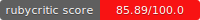

# Setup



## Integrantes del equipo:
- Raul Alejandro Almanza Serrano
- Alejandro Cabrera Moncada
- Paola Lisset Santollo Vargas

## Pasos para ejecutar el proyecto
- Descargar repositorio: 
``` sh 
$ git clone https://github.com/Brightcoders-Bootcamps/gilded-rose-refactoring-kata-golden-rose-team-3-1.git 
```
- Moverte a la carpeta:
```sh
$ cd gilded-rose-refactoring-kata-golden-rose-team-3-1/ruby
```
- Instalar gemas del proyecto:
```sh
$ bundle install
```
- Ejecutar el fixture:
```sh
$ ruby texttest_fixture.rb
```

**Nota:** Tu puedes pasar la cantidad de dias que quieras al ejecutar el comando, de igual manera si quieres modificar valores de los items creados o agregar más items, puedes hacerlo modificando ese mismo archivo.

## Pasos para ejecutar el archivo de pruebas

- Ejecutar el archivo spec:
```sh
$ rspec gilded_rose_spec.rb
```

## Verificar puntuación con Rubycritic

- Ejecutar comando:
```sh
$ rubycritic
```

## Verificar puntuación Sandi-meter

- Ejecutar comando:
```sh
$ sandi_meter
```